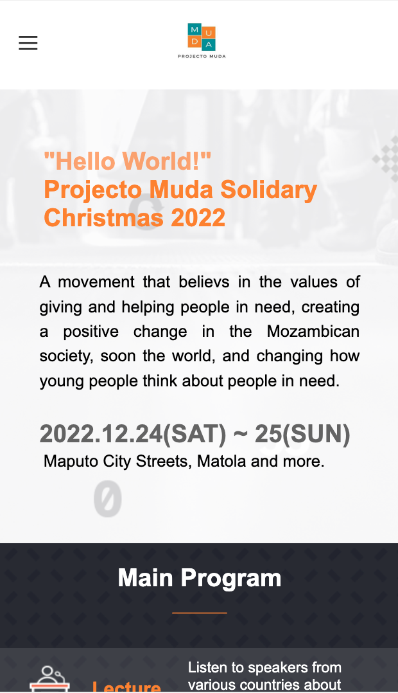
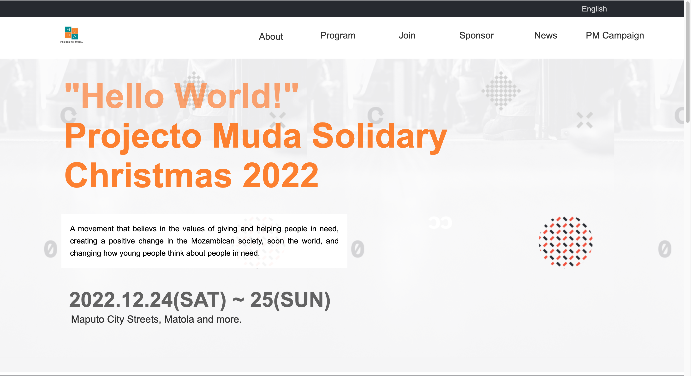

# Portfolio
This is a website for a nonprofit movement. 

## Built With
HTML & CSS

## Live Demo 
[Projecto Muda](https://enoquejonas.github.io/)

## Preview

## Getting Started
To set up this project, you just need a pc. Download the files to your computer of choice and everything is set.

### Prerequisites
A computer

### Setup
Clone or download the files.

### Install
No installation is needed.

## Authors
👤 Enoque Jonas Macanda

- GitHub: @enoquejonas
- Twitter: @enoquejonas
- LinkedIn: Enoque Macanda

# 🤝 Contributing
Contributions, issues, and feature requests are welcome!

Feel free to check the issues page.

Show your support
Give a ⭐️ if you like this project!

# 📝 License
This project is [MIT](https://github.com/enoqueJonas/ProjectoMuda/blob/main/LICENSE) licensed.

